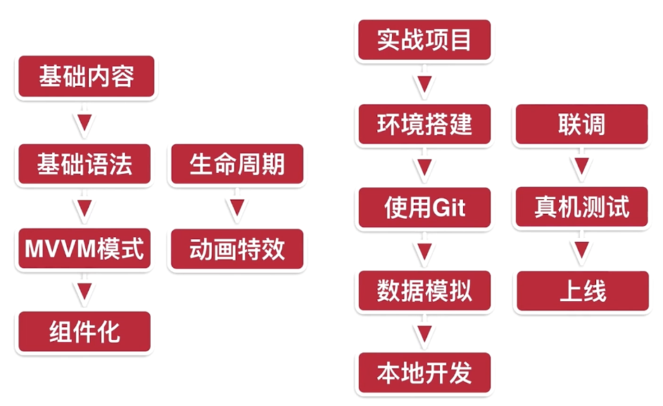

### 课程内容简介

* 

* 生命周期函数就是Vue实例在某一个时间点会自动执行的函数

* 

* 计算属性 computed   有缓存性能比较高
  * get
  * set
  
* 方法   methods   没有缓存机制

* 监听器 watch  也有一个缓存  和计算属性差不多，但是watch更复杂。

* Vue中的样式绑定

* v-bind:可以省略为：   v-on:click简写为@click

* v-if和v-else要连在一起写

* 给input添加key值，虚拟dom

* 数组的方法：push pop shift unshift splice sort reverse

* 改变数据的引用

* vue.set方法。对象，数组都可以。

  * ```
    Vue.set(vm.userInfo,1,5)  
    Vue.$set(vm.userInfo,2,10) vue对象的set方法，实例方法$set
    ```

* is语法

* 在子组件定义一个data必须是一个函数，不能是对象。


### 项目

* 路由就是根据网址的不同，返回不同的内容给用户

* 相关配置

  * ```
    解决触屏点击300ms延迟的问题
    npm install fastclick --save
    
    利用board.css库解决不同特性的手机的边框问题
    
    利用resize.css  不同手机初始化的统一
    
    iconfont 图标
    
    无用代码的删除
    
安装CSS相关的配置：
    npm install stylus --save
    npm install stylus-loader --save
    
    ```
    
    lang="stylus" 可以让css更简单  scoped  让style作用局部化
    
    <style lang="stylus" scoped>
        
    display：flex  弹性布局
        
    color是字体的颜色, background-color是背景的颜色
        
    项目里的iconfont是通过下载到本地使用的
    
    ​    


### problems

* ```
  <!-- <link rel="stylesheet" type="text/css" href="./animate.css"> -->
      <link href="https://cdn.jsdelivr.net/npm/animate.css@3.5.1" rel="stylesheet" type="text/css">
  ```

  第一种引入方式是不可以的，第二种引入方式是可以的，不知道为什么。